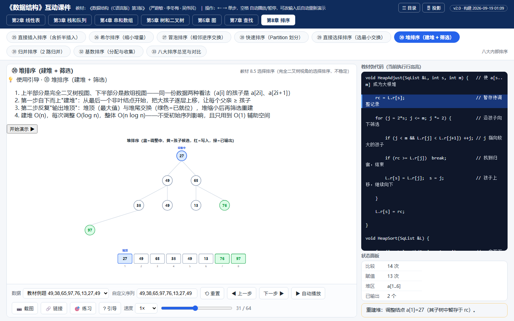
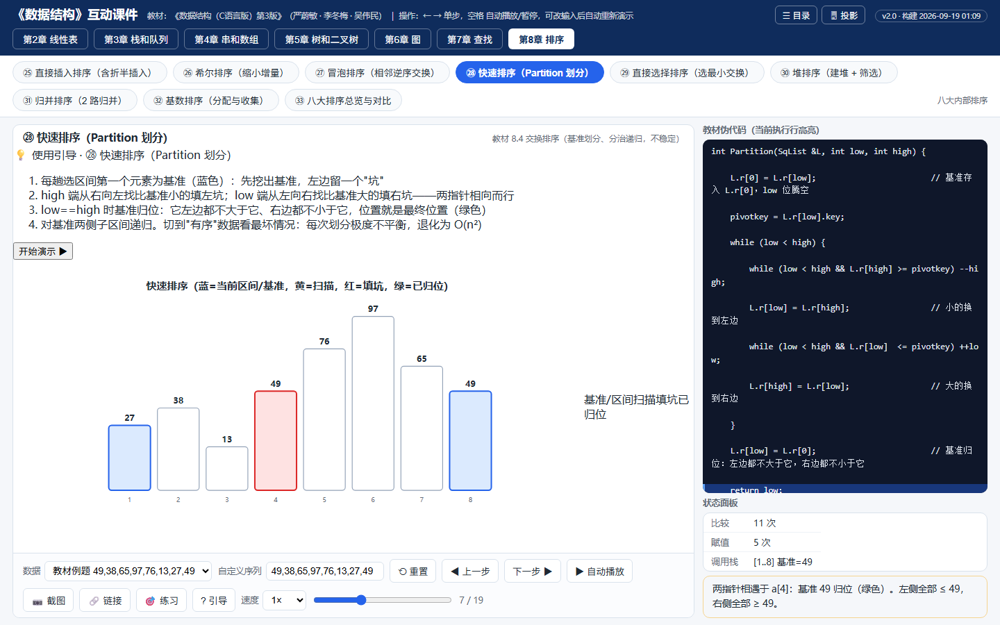
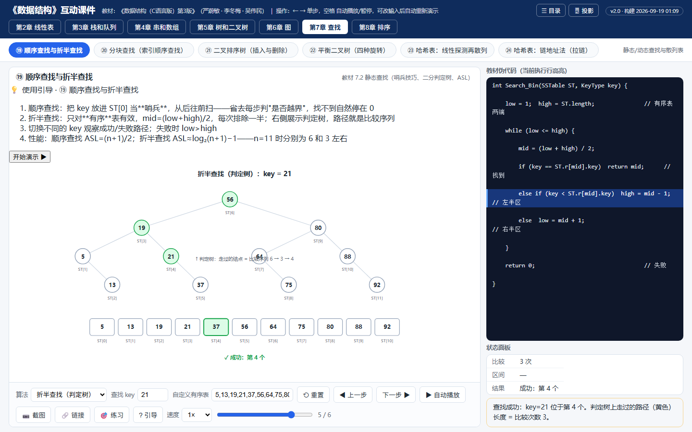
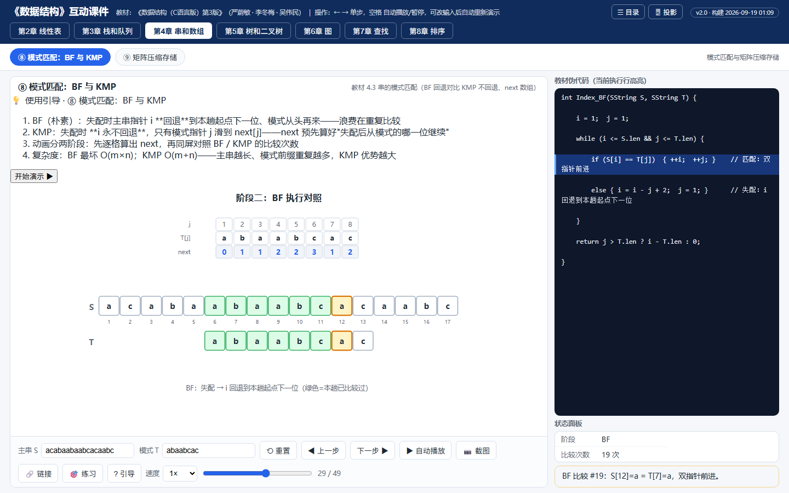
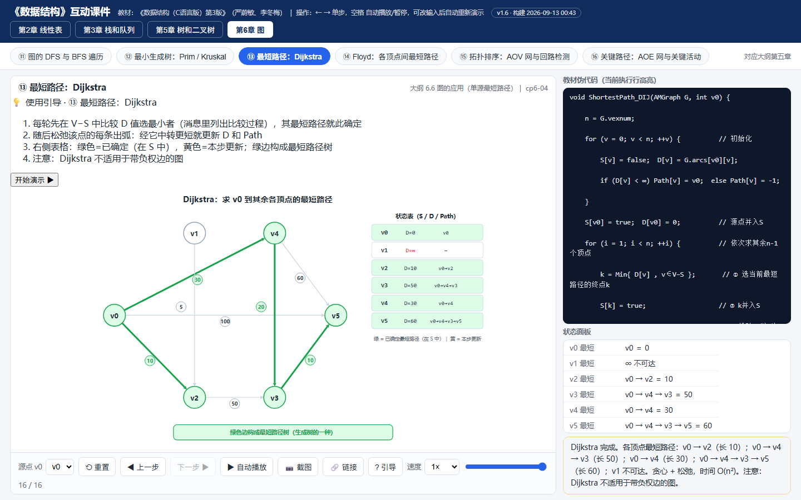
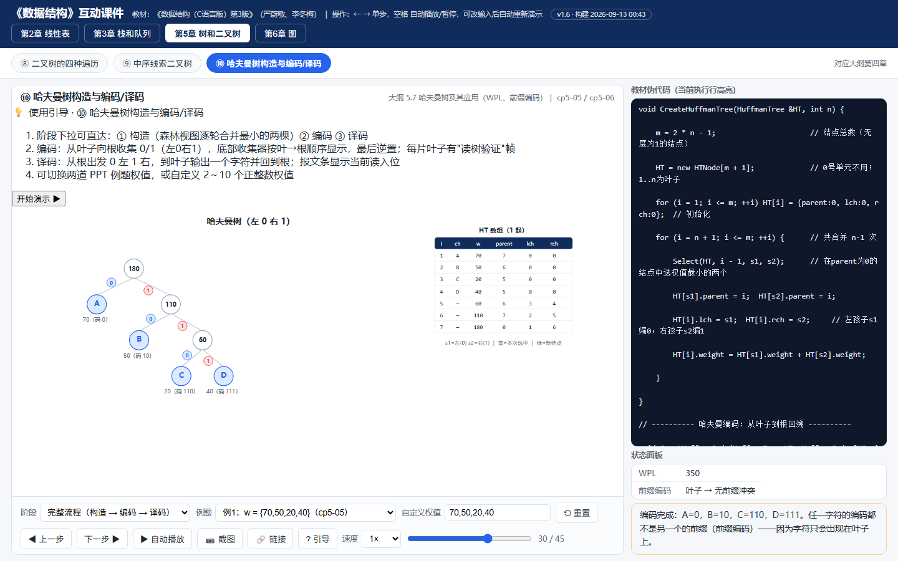
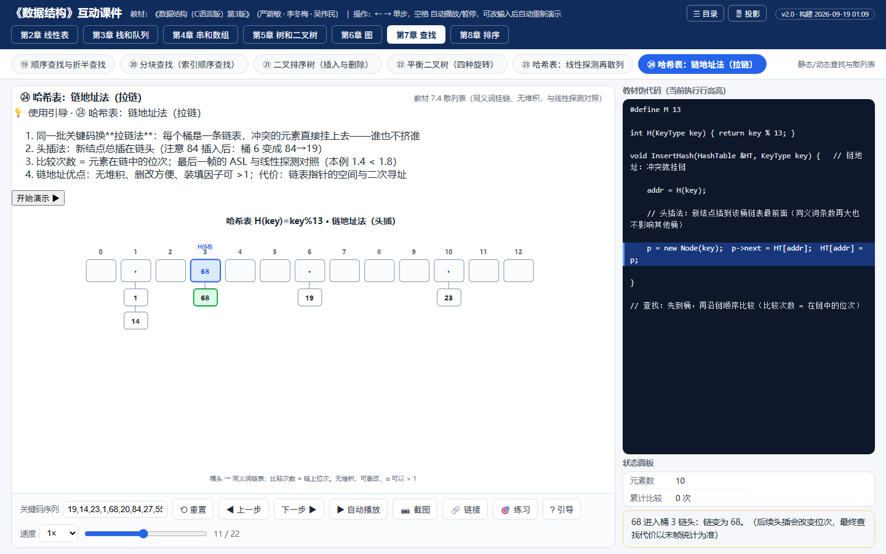
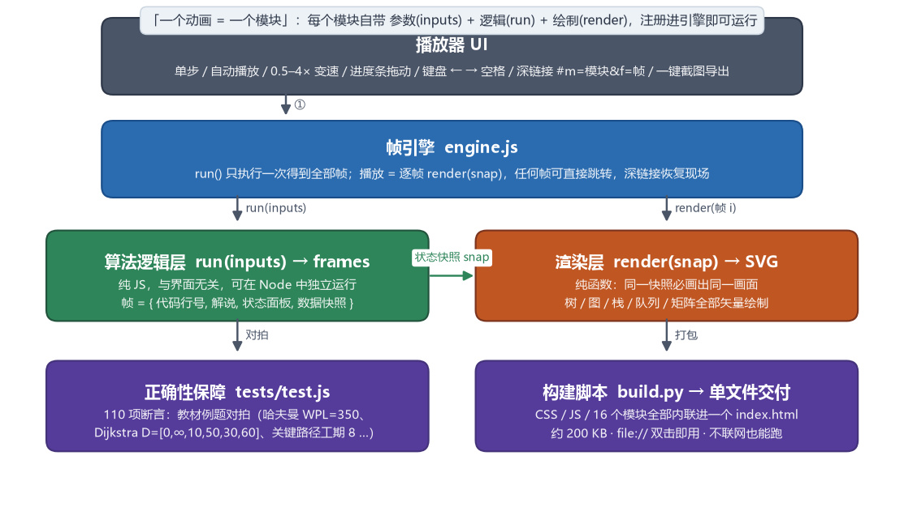

<div align="center">
  

      

  **[▶ 在线打开（点开就用）](https://ch1209498273.github.io/ds-animations/) ｜ [⬇ 下载单文件 zip](https://github.com/ch1209498273/ds-animations/raw/main/ds-animations-v2.8.zip)**

  © 2026 **芦老师聊AI** · 版权归芦老师聊AI所有，未经授权不得商用

  覆盖《数据结构（C语言版）》全部 8 章核心算法，与严蔚敏·李冬梅版教材例题逐一对拍验证
</div>

---

## 这是什么

一个**纯前端、单文件、零依赖**的数据结构算法动画课件：每个动画都由「算法逻辑层」真实执行得出状态帧序列，再逐帧渲染——**演示的过程就是算法执行的过程**，不是手绘的假动画。

- 🎯 **为课堂而生**：单屏展示不滚动、教材伪代码随执行高亮、首帧操作引导、🖥 投影模式
- 🔬 **为理解而生**：不只演示"正确的做法"，还演示**错误的做法**（顺序表从前向后移会怎样？链表先断后连会怎样？）——对照着看才真正懂
- ✍️ **为放映而生**：⛶ 全屏放映只留画面与播控（`C` 键放映中直接切动画）；自动播放按解说长度定帧（约 1.1~2.2 秒/帧），不再一闪而过；「第 N 趟/轮」边界自动多停一拍，`PageDown`/`PageUp` 按节拍跳转
- 📱 **也为手机而生**：≤700px 独立布局（页头压到 85px、舞台占半屏以上、可点元素全部达 44px 触摸标准），画面上单指横滑翻页、双指捏合缩放、双击放大看标注；**⛶ 手机放映**（v2.6）只留画面，左右缘 ‹ › 箭头翻页、画面严格铺满窗口，竖屏自动转横屏；小字用双击放大
- ⌨️ **操作顺手**：单步 / 回退 / 自动播放 / 0.25–4× 变速 / 进度条任意拖动 / 键盘 ← → 空格 Home End / 画面缩放平移（`Ctrl`+滚轮、`⋯ 更多` 展开完整操作台）/ 一键截图（自动带版权水印）/ ☰ 总目录直达
- 🔗 **单动画分享页**：每个动画一个独立网页（约 60KB）+ 二维码，分享出去只打开那一个动画——[示例](https://ch1209498273.github.io/ds-animations/a/heapSort.html)
- 🛡 **错误演示场景**：双向链表指针操作顺序颠倒、单链表先断后连……演给你看"为什么不能这么写"
- 📢 **无障碍细节**：解说区 aria-live 播报、动画图 role=img、进度条可标注

## 动图预览

哈夫曼树完整流程：构造（森林逐轮合并）→ 编码（叶→根收集 0/1，显式逆置 + 读树验证）→ 译码（报文 100110111 → BACD）：

<div align="center"></div>

## 截图选览

点击图片下方的「直达」链接可跳到**线上课件的同一步**：

| | |
|---|---|
| <br>**堆排序**：完全二叉树 + 数组双视图联动，建堆/筛选逐帧 · [直达](https://ch1209498273.github.io/ds-animations/#m=heapSort&f=30) | <br>**快速排序**：Partition 双指针填坑 + 递归调用栈 · [直达](https://ch1209498273.github.io/ds-animations/#m=quickSort&f=6) |
| <br>**折半查找**：判定树随比较路径点亮，ASL 可验 · [直达](https://ch1209498273.github.io/ds-animations/#m=seqBinSearch&mode=bin&key=21&f=4) | <br>**八大排序总览**：同一数据 × 8 算法 × 代价对照 · [直达](https://ch1209498273.github.io/ds-animations/#m=sortGallery&f=8) |
| <br>**模式匹配 BF/KMP**：next 逐格计算，主串指针不回退对照 · [直达](https://ch1209498273.github.io/ds-animations/#m=kmp&f=28) | <br>**Dijkstra 最短路径**：图、状态表、伪代码三方联动 · [直达](https://ch1209498273.github.io/ds-animations/#m=dijkstra&f=15) |
| <br>**哈夫曼树**：树 + HT 数组同步，WPL=350 可验 · [直达](https://ch1209498273.github.io/ds-animations/#m=huffman&f=29) | <br>**哈希表·链地址**：同余挂链，与线性探测 ASL 对照 · [直达](https://ch1209498273.github.io/ds-animations/#m=hashChain&f=10) |

## 42 个动画目录

用 [在线总目录](https://ch1209498273.github.io/ds-animations/)（页面右上角 ☰，或放映中按 `C`）可按章浏览并复制任意一步的深链接。

> 下面刻意**不标 ①②③ 序号**——站内序号按注册顺序自动生成，加一个动画就会让后面全部错位，写进文档就是维护陷阱。要序号看 ☰ 目录。

**第1章 绪论**：时间复杂度可视化（六阶增长曲线）
**第2章 线性表**：顺序表插入/删除 · 单链表插入/删除 · 顺序表基本操作合集 · 链表基本操作合集 · 合并有序表 · 双向/循环链表 · 一元多项式相加
**第3章 栈和队列**：顺序栈 · 假溢出与循环队列（四方案） · 递归调用栈·汉诺塔 · 括号匹配 · 表达式求值（双栈法） · 数制转换 · 迷宫求解
**第4章 串和数组**：模式匹配 BF/KMP（next 数组） · 矩阵压缩存储（对称映射 + 快速转置）
**第5章 树和二叉树**：四种遍历 · 中序线索二叉树 · 哈夫曼树与编码/译码 · 树/森林与二叉树转换
**第6章 图**：DFS/BFS · Prim/Kruskal 最小生成树 · Dijkstra · Floyd · 拓扑排序（含回路检测） · 关键路径
**第7章 查找**：顺序/折半查找（判定树 + ASL） · 分块查找 · 二叉排序树 · AVL 四种旋转 · 哈希·线性探测 · 哈希·链地址
**第8章 排序**：直接插入（含折半） · 希尔 · 冒泡 · 快速 · 直接选择 · 堆排序 · 归并 · 基数 · 八大排序总览对比

> 第 2、3、7、8 章的多数模块支持**自定义数据**（改权值、改表达式、换存储结构、随机/有序/逆序/几乎有序预设），课堂上可以现场出题现场演；第 6 章目前只能切预设图，自定义图已排期。

## 快速开始

**方式一 · 在线用**：打开 [ch1209498273.github.io/ds-animations](https://ch1209498273.github.io/ds-animations/)，点开即用。

**方式二 · 本地用（推荐课堂场景）**：[下载 zip](https://github.com/ch1209498273/ds-animations/raw/main/ds-animations-v2.8.zip)，解压双击 `数据结构动画课件.html`——不联网、不装任何环境，教室机也能跑。

**方式三 · 开发者**：

```bash
git clone https://github.com/ch1209498273/ds-animations.git
# 双击 index.html 即可使用；改源码后运行 python build.py 重新构建
node tests/test.js   # 288 项正确性断言
```

## 架构与实现

<div align="center"></div>

几个关键设计：

- **逻辑与展示彻底分离**：`run(inputs)` 是纯算法，产出 `frames[{line, msg, panel, snap}]`；`render(snap)` 是纯函数。因此每帧可任意跳转、回退绝不走样
- **快照一律深拷贝**：帧记录的是"当时"的状态，后续步骤的修改不会污染历史帧
- **模块即插即用**：新增一个动画 = 写一个 `DSC.reg({...})` 模块，编号自动分配
- **深链接直达**：`#m=模块id&参数=值&f=帧号` 可分享任何动画的任何一步

## 正确性保障

`tests/test.js` 内置 **288 项断言**（GitHub Actions 每次推送自动执行），与教材/PPT 例题逐一对拍，例如：

- 排序：教材例 `{49,38,65,97,76,13,27,49*}` 每一趟结果（插入/希尔/冒泡/快排/选择/堆/归并逐趟对拍），基数排序三趟收集结果与教材一致
- 查找：折半判定树路径 `6→3→4`；哈希线性探测终表与教材一致、ASL=1.80；链地址 ASL=1.50
- 串：KMP `next("abaabcac") = 0,1,1,2,2,3,1,2`；BF 20 次 vs KMP 15 次
- 树：BST 删除三情形后中序仍递增；AVL 四种旋转后全部 |bf|≤1
- 图：Dijkstra `D=[0,∞,10,50,30,60]`；Prim/Kruskal 总权值 15；关键路径工期 8

## 常见问题

**Q：github.io 打不开 / 很慢？**
国内访问 GitHub Pages 不稳定。下载 zip（[仓库内直链](https://github.com/ch1209498273/ds-animations/raw/main/ds-animations-v2.8.zip)），解压双击打开，体验完全一致。

**Q：手机上能用吗？**
**Q：手机上能用吗？**
能用，推荐 **⛶ 手机放映**（v2.6）：只留画面，左右缘 ‹ › 箭头翻页，画面严格铺满窗口不用拖动，竖屏进入自动转成横屏，右上角 ✕ 退出，`&mp=1` 深链可分享。
注意画布是 980×500 的横宽比，**竖屏下宽度只有 390px，字必然只有 4~5px**——这不是没做适配，是几何决定的，请用横屏或双击放大。

**Q：不是这个教材/学校能用吗？**
可以。界面只对齐《数据结构（C语言版）》通用章节体系（严蔚敏经典八章），不绑定任何学校；两套教材章节编号兼容。

**Q：怎么给学生的作业里嵌入某个动画？**
iframe 引用在线地址即可，目录页可一键复制任意动画的深链接。

## 参与

- 发现演示错误、文字错误 → [提 Issue](../../issues/new?template=bug_report.md)
- 想要新动画（B 树、KMP 优化 nextval、串的其他算法等）→ [动画许愿](../../issues/new?template=feature_request.md)
- PR 欢迎：改完跑 `node tests/test.js` 保证 288 项全绿

## 声明

- 全部内容（代码 + 文案 + 素材）以 [CC BY-NC-SA 4.0](LICENSE) 授权：署名-非商业-相同方式共享，**请勿商用**
- 例题与术语对齐《数据结构（C语言版）第3版》（严蔚敏、李冬梅、吴伟民，人民邮电出版社），仅作教学对齐用途
