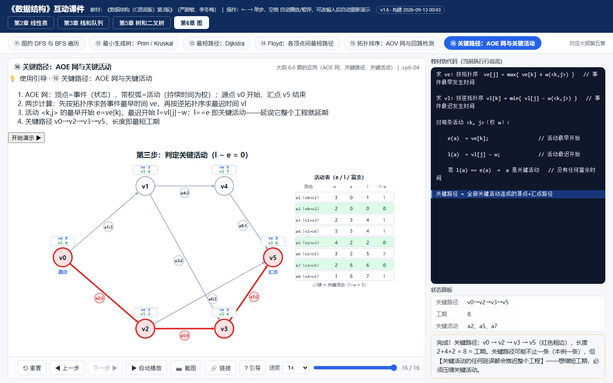
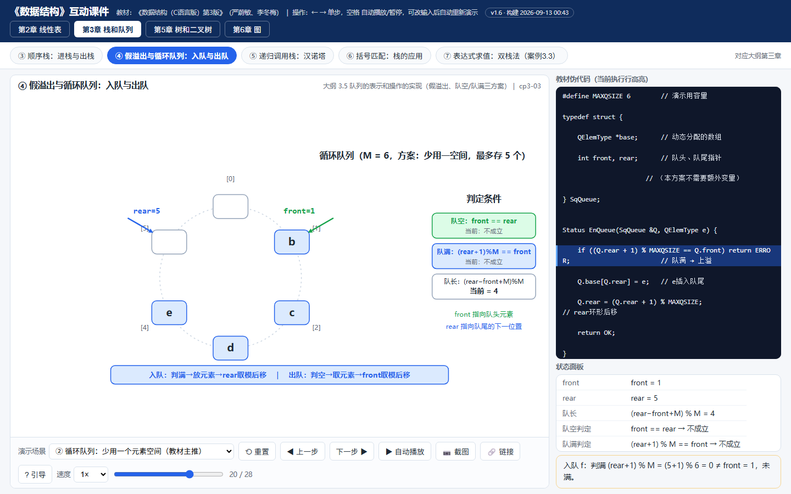
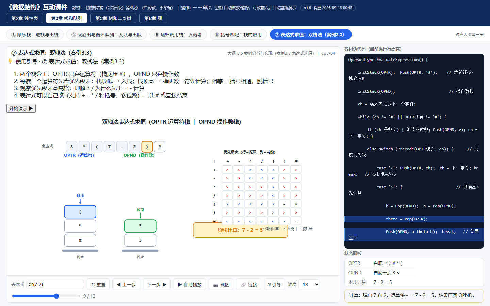
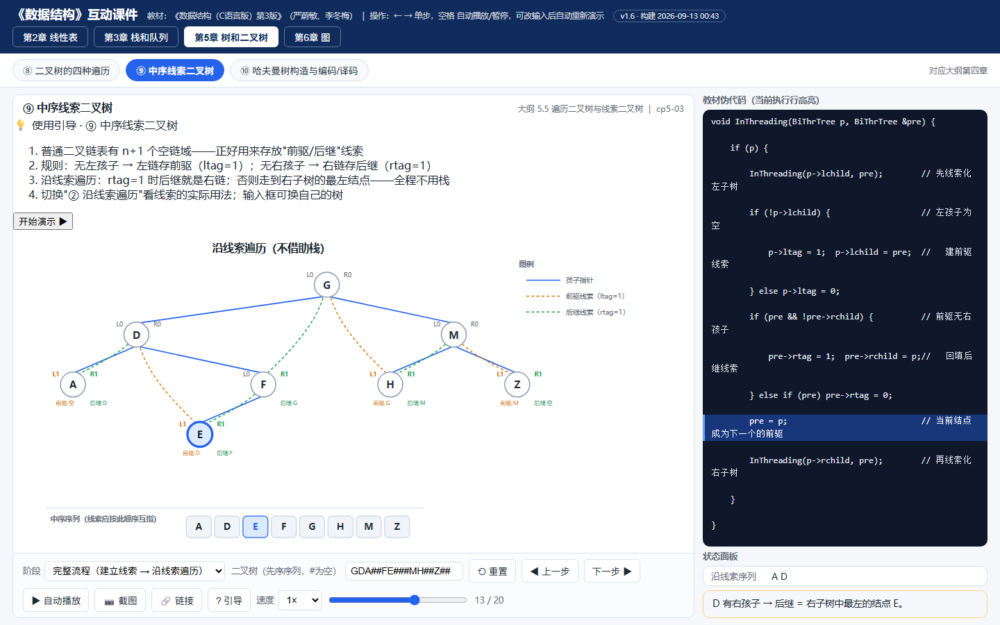
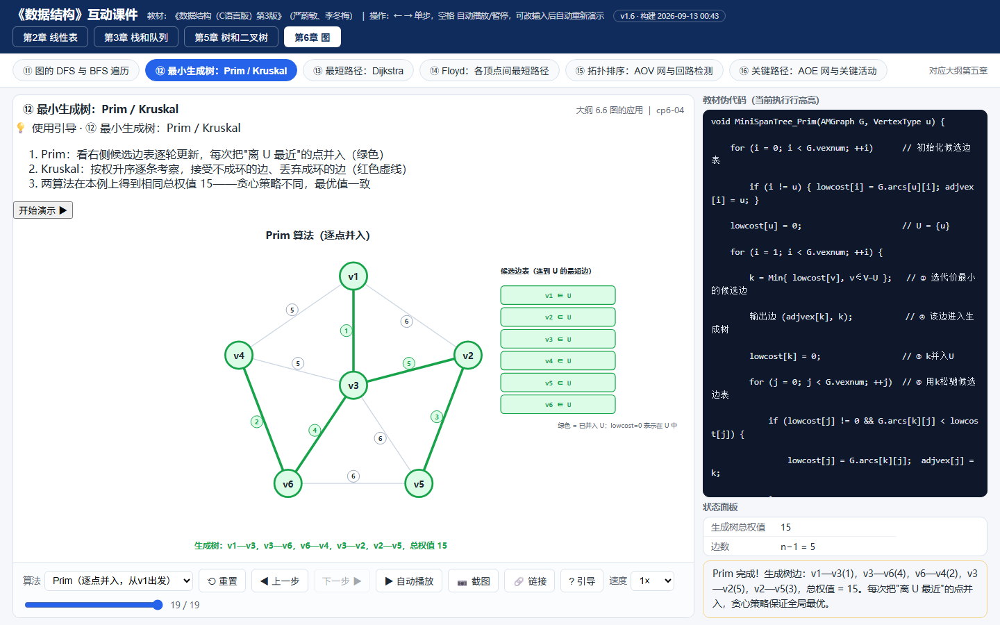
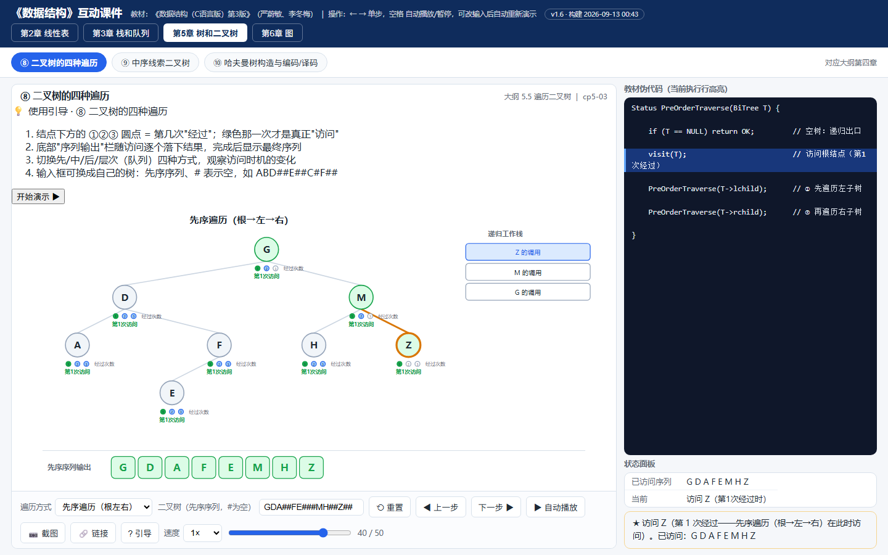

<div align="center">
  

      

  **[▶ 在线打开（点开就用）](https://ch1209498273.github.io/ds-animations/) ｜ [⬇ 下载单文件 zip](ds-animations-v1.6.zip)**

  覆盖《数据结构（C语言版）》第 2 / 3 / 5 / 6 章核心难点，与严蔚敏·李冬梅版教材例题逐一对拍验证
</div>

---

## 这是什么

一个**纯前端、单文件、零依赖**的数据结构算法动画课件：每个动画都由「算法逻辑层」真实执行得出状态帧序列，再逐帧渲染——**演示的过程就是算法执行的过程**，不是手绘的假动画。

- 🎯 **为课堂而生**：单屏展示不滚动、教材伪代码随执行高亮、首帧自带操作引导
- 🔬 **为理解而生**：不只演示"正确的做法"，还能演示**错误的做法**（顺序表从前向后移会怎样？链表先断后连会怎样？）——对照着看才真正懂
- ⌨️ **操作顺手**：单步 / 回退 / 自动播放 / 0.5–4× 变速 / 进度条任意拖动 / 键盘 ← → 空格 / 一键截图导出 PNG

## 动图预览

哈夫曼树完整流程：构造（森林逐轮合并）→ 编码（叶→根收集 0/1，显式逆置 + 读树验证）→ 译码（报文 100110111 → BACD）：

<div align="center"></div>

## 截图选览

点击图片下方的「直达」链接可跳到**线上课件的同一步**：

| | |
|---|---|
| <br>**⑬ Dijkstra 最短路径**：图、状态表、伪代码三方联动，绿边构成最短路径树 · [直达](https://ch1209498273.github.io/ds-animations/#m=dijkstra&f=15) | <br>**⑯ 关键路径 AOE**：ve/vl 三步推演 + 活动表，红色粗边标出关键路径 v0→v2→v3→v5（工期 8）· [直达](https://ch1209498273.github.io/ds-animations/#m=critical&f=15) |
| <br>**⑩ 哈夫曼树**：树 + HT 数组 + 伪代码同步，编码完成后 WPL=350 直接可验 · [直达](https://ch1209498273.github.io/ds-animations/#m=huffman&f=29) | <br>**④ 循环队列**：环形布局直观呈现取模后移，队空/队满判定条件随帧更新 · [直达](https://ch1209498273.github.io/ds-animations/#m=circQueue&demo=fewer&f=19) |
| <br>**⑦ 表达式求值（双栈法）**：OPTR/OPND 双栈 + 教材优先级表 + 弹栈计算提示 · [直达](https://ch1209498273.github.io/ds-animations/#m=expression&f=8) | <br>**⑨ 中序线索二叉树**：实线=孩子指针，虚线=前驱/后继线索，沿线索遍历全程不用栈 · [直达](https://ch1209498273.github.io/ds-animations/#m=threads&f=12) |
| <br>**⑫ 最小生成树 Prim**：候选边表逐轮松弛，零交叉平面布局 · [直达](https://ch1209498273.github.io/ds-animations/#m=mst&f=18) | <br>**⑧ 二叉树四种遍历**：每个结点标出"第几次经过"，绿色那次才是访问；递归栈同步 · [直达](https://ch1209498273.github.io/ds-animations/#m=traversal&f=39) |

## 16 个动画目录

| # | 动画 | 亮点 | 直达 |
|---|------|------|------|
| ① | 顺序表的插入与删除 | 腾空移动动画；"错误方向"演示数据被覆盖 | [打开](https://ch1209498273.github.io/ds-animations/#m=seqList) |
| ② | 单链表的插入与删除 | 先连后断逐步分解；"先断后连"丢链错误演示 | [打开](https://ch1209498273.github.io/ds-animations/#m=linkList) |
| ③ | 顺序栈：进栈与出栈 | `*S.top++` 两步逐帧分解；栈满/栈空判定 | [打开](https://ch1209498273.github.io/ds-animations/#m=seqStack) |
| ④ | 假溢出与循环队列 | 同一数据四种方案对照：普通队列 / 少用一空间 / size 计数 / tag 标志 | [打开](https://ch1209498273.github.io/ds-animations/#m=circQueue) |
| ⑤ | 递归调用栈：汉诺塔 | 盘片移动与递归工作栈严格同步，每步标注触发帧 | [打开](https://ch1209498273.github.io/ds-animations/#m=hanoi) |
| ⑥ | 括号匹配：栈的应用 | 配对成功 / 右括号失配 / 扫描完栈非空三种结局 | [打开](https://ch1209498273.github.io/ds-animations/#m=bracket) |
| ⑦ | 表达式求值：双栈法 | 教材优先级表逐格对照；多位数组装；除零报错 | [打开](https://ch1209498273.github.io/ds-animations/#m=expression) |
| ⑧ | 二叉树的四种遍历 | 三次经过进度点 × 访问时机；先/中/后/层序切换 | [打开](https://ch1209498273.github.io/ds-animations/#m=traversal) |
| ⑨ | 中序线索二叉树 | 建线索 + 沿线索遍历两阶段；n+1 空指针全部利用 | [打开](https://ch1209498273.github.io/ds-animations/#m=threads) |
| ⑩ | 哈夫曼树构造与编码/译码 | 森林合并 → 收集 0/1 显式逆置 → 读树验证 → 报文译码 | [打开](https://ch1209498273.github.io/ds-animations/#m=huffman) |
| ⑪ | 图的 DFS 与 BFS | 邻接矩阵 / 邻接表（头插法）存储切换，序列对照 | [打开](https://ch1209498273.github.io/ds-animations/#m=dfsBfs) |
| ⑫ | 最小生成树：Prim / Kruskal | 双算法同一图对照，总权值一致（15）；Kruskal 排序边表 + 避环 | [打开](https://ch1209498273.github.io/ds-animations/#m=mst) |
| ⑬ | 最短路径：Dijkstra | 选点比较清单 + 逐弧松弛；贪心正确性随帧可见 | [打开](https://ch1209498273.github.io/ds-animations/#m=dijkstra) |
| ⑭ | Floyd：各顶点间最短路径 | D 矩阵逐格更新高亮 + 前驱回溯还原完整路径 | [打开](https://ch1209498273.github.io/ds-animations/#m=floyd) |
| ⑮ | 拓扑排序：AOV 网 | 入度表 + 栈 + 删弧；勾选回路边演示回路判定失败 | [打开](https://ch1209498273.github.io/ds-animations/#m=topo) |
| ⑯ | 关键路径：AOE 网 | ve/vl 逆向推演 + 活动表 e/l/余量，关键活动一色标出 | [打开](https://ch1209498273.github.io/ds-animations/#m=critical) |

> 大多数模块支持**自定义数据**（改权值、改表达式、换存储结构、调递归盘数），课堂上可以现场出题现场演。

## 快速开始

**方式一 · 在线用**：打开 [ch1209498273.github.io/ds-animations](https://ch1209498273.github.io/ds-animations/)，点开即用。

**方式二 · 本地用（推荐课堂场景）**：[下载 zip](ds-animations-v1.6.zip) 解压，双击 `数据结构动画课件.html`——不联网、不装任何环境，教室机也能跑。

**方式三 · 开发者**：

```bash
git clone https://github.com/ch1209498273/ds-animations.git
# 直接双击 ds-animations/index.html 即可
# 源码结构见下方架构说明，改完跑 node tests/test.js 验证
```

## 架构与实现

<div align="center"></div>

几个关键设计：

- **逻辑与展示彻底分离**：`run(inputs)` 是纯算法，产出 `frames[{line, msg, panel, snap}]`；`render(snap)` 是纯函数，同一快照必画出同一画面。因此每帧可任意跳转、回退绝不走样
- **快照一律深拷贝**：帧记录的是"当时"的状态，后续步骤的修改不会污染历史帧
- **模块即插即用**：新增一个动画 = 写一个 `DSC.reg({...})` 模块（参数 + 逻辑 + 绘制），构建脚本自动收录
- **深链接直达**：`#m=模块id&f=帧号` 可分享任何动画的任何一步，课件备课超方便

## 正确性保障

`tests/test.js` 内置 **110 项断言**，与教材/PPT 例题逐一对拍，例如：

- 哈夫曼 `w={70,50,20,40}` → 编码 A=0 / B=10 / C=110 / D=111，WPL = 350
- Dijkstra → `D = [0, ∞, 10, 50, 30, 60]`；Floyd 4×4 终态矩阵逐格断言
- Prim / Kruskal 边集一致且总权值 15；关键路径 a2/a5/a7、工期 8
- 遍历序列 GDAFEMHZ / ADEFGHMZ / AEFDHZMG；汉诺塔 7 步全序列

## 常见问题

**Q：github.io 打不开 / 很慢？**
国内访问 GitHub Pages 不稳定。点 [⬇ 下载 zip](ds-animations-v1.6.zip)，解压双击打开，体验完全一致。

**Q：手机上能用吗？**
可以。单文件自适应布局，触屏单步播放都没有问题。

**Q：能换成我自己讲的数据吗？**
大部分动画的参数面板支持自定义（权值、表达式、序列、盘数等），改完点「重置」即按新数据重新演示。

**Q：怎么给学生的作业里嵌入某个动画？**
iframe 引用在线地址即可，也可用深链接直接定位到某一步。

## 声明

- 本项目与教材出版方无隶属关系，仅供教学与学习交流，**请勿商用**
- 例题与术语对齐《数据结构（C语言版）第3版》（严蔚敏、李冬梅，人民邮电出版社）
- 欢迎 Issue 反馈 bug / 许愿新动画（排序、查找等章节在计划中）
